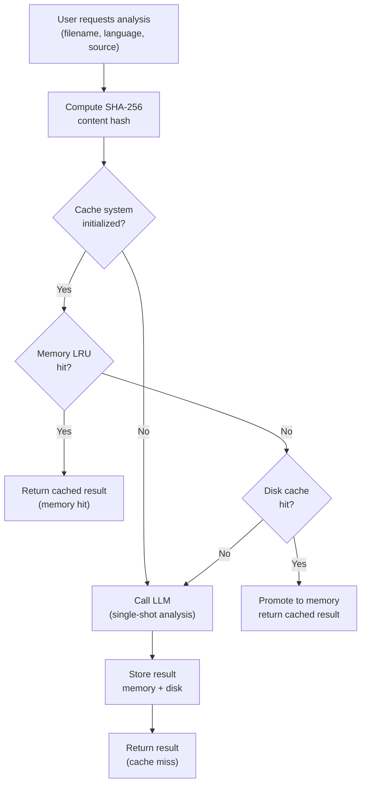

# Backend Current Status

## Summary
The backend runs a single-shot LLM analysis pipeline that produces File Intent and Responsibility Blocks for a given file. It prioritizes speed, simplicity, and determinism, with a two-tier cache to reduce cost and latency.

## Current architecture
- **Single-shot inference**: One LLM call per analysis, no tool-calling or multi-agent orchestration.
- **Structured output**: JSON schema with `file_intent` and `responsibility_blocks`.
- **Caching**: Memory LRU + disk cache, content-addressed by SHA-256.

## Cache flow visualization (user request scenarios)

Notes:
- Disk entries expire after TTL (default 30 days); expired entries are deleted on read and during startup cleanup.
- Local cache hits/misses and OpenAI usage are tracked by `CacheMonitor`.

## API surface

**Production Endpoint:** `https://api.iris-codes.com`

- **POST /api/iris/analyze**
  - Input: `filename`, `language`, `source_code` (with line numbers), optional `metadata`.
  - Output: `file_intent`, `responsibility_blocks`, `metadata`.
  - Authentication: `x-api-key` header required.
- **GET /api/iris/health**: Agent readiness check (no authentication required).

## Supported languages
- Python
- JavaScript
- TypeScript

## Key modules
- `server.py`: Flask application entry point, CORS configuration.
- `routes.py`: Flask API blueprint (`/api/iris`), authentication middleware.
- `agent.py`: Single-shot orchestration, cache lookup, OpenAI usage tracking.
- `prompts.py`: System prompt and output schema.
- `analysis_cache.py`: LRU + disk cache, TTL cleanup.
- `cache_monitor.py`: Local cache metrics and OpenAI cost tracking.
- `lambda_handler.py`: *(Deprecated)* Mangum WSGI adapter for AWS Lambda deployment.

## Known constraints
- Analysis is file-scoped (single file per request).
- Cache invalidation is content-based only.
- No multi-file or project-wide reasoning.

## Deployment

Deployed on **AWS EC2** at `https://api.iris-codes.com`. Stack: Nginx → Gunicorn → Flask, with persistent local disk cache at `/var/iris/cache`. Authentication via `x-api-key` header.

Full deployment details: [`backend/specs/deployment/deployment-state.md`](specs/deployment/deployment-state.md)
