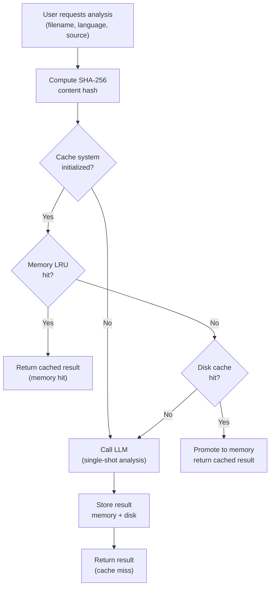

# Backend Current Status

## Summary
The backend runs a single-shot LLM analysis pipeline that produces File Intent and Responsibility Blocks for a given file. It prioritizes speed, simplicity, and determinism, with a two-tier cache to reduce cost and latency.

## Current architecture
- **Single-shot inference**: One LLM call per analysis, no tool-calling or multi-agent orchestration.
- **Structured output**: JSON schema with `file_intent` and `responsibility_blocks`.
- **Caching**: Memory LRU + disk cache, content-addressed by SHA-256.

## Cache flow visualization (user request scenarios)



Notes:
- Disk entries expire after TTL (default 30 days); expired entries are deleted on read and during startup cleanup.
- Local cache hits/misses and OpenAI usage are tracked by `CacheMonitor`.

## API surface
- **POST /api/iris/analyze**
  - Input: `filename`, `language`, `source_code` (with line numbers), optional `metadata`.
  - Output: `file_intent`, `responsibility_blocks`, `metadata`.
- **GET /api/iris/health**: Agent readiness check.

## Supported languages
- Python
- JavaScript
- TypeScript

## Key modules
- `agent.py`: Single-shot orchestration, cache lookup, OpenAI usage tracking.
- `prompts.py`: System prompt and output schema.
- `analysis_cache.py`: LRU + disk cache, TTL cleanup.
- `cache_monitor.py`: Local cache metrics and OpenAI cost tracking.
- `routes.py`: Flask API endpoints.
- `lambda_handler.py`: Mangum WSGI adapter exposing the Flask app as an AWS Lambda handler.

## AWS Lambda deployment
- **Adapter**: Mangum wraps the Flask WSGI app to translate API Gateway events.
- **Handler entry point**: `lambda_handler.handler` (for container CMD / Lambda config).
- **Runtime**: Container image based on AWS Lambda Python base image.
- **Local dev unchanged**: `app.run()` remains guarded under `__main__`; Mangum is only invoked by Lambda.
- **Specs**: `backend/specs/deployment/` contains the deployment plan and implementation details.

## Known constraints
- Analysis is file-scoped (single file per request).
- Cache invalidation is content-based only.
- No multi-file or project-wide reasoning.

## Deployment

### Current Setup (AWS Lambda)

**Infrastructure:**
- **AWS Lambda** (containerized): Python runtime deployed as Docker container image to ECR (Elastic Container Registry)
- **API Gateway** (HTTP API): Public endpoint routing requests to Lambda function
- **Authentication**: Temporary API key validation via custom header (`X-API-Key`)
  - Planned migration: GitHub OAuth

**Container Image:**
- Base: AWS Lambda Python 3.11 base image (`public.ecr.aws/lambda/python:3.11`)
- Build: Multi-stage Docker build
  - Stage 1: Install dependencies from `requirements.txt`
  - Stage 2: Copy source code, set Lambda handler entry point
- Entry point: `lambda_handler.handler` (Mangum WSGI adapter wrapping Flask app)
- Pushed to: AWS ECR (private repository)

**Deployment Flow:**
```
1. Build Docker image locally (or CI/CD)
2. Tag image with ECR repository URI
3. Push to ECR: aws ecr get-login-password | docker push
4. Update Lambda function: aws lambda update-function-code --image-uri
5. API Gateway invokes Lambda on HTTP requests
```

**Environment Variables:**
- `OPENAI_API_KEY`: LLM inference (stored in Lambda env config)
- `API_KEY`: Temporary authorization secret
- Cache paths: Lambda uses `/tmp` (ephemeral, not persistent across invocations)

**Known Limitations:**
- **Cache does not persist**: Lambda's ephemeral `/tmp` and isolated containers mean cache is lost between invocations or across instances
- **Cold starts**: First request after idle period incurs 1-3s initialization latency
- **Cost inefficiency**: ElastiCache Redis (~$15/month) required for persistent caching, negating Lambda's pay-per-use advantage at low traffic

**Future Migration Planned:**
- **Target**: EC2 t3.micro instance (free tier eligible, 10 months remaining)
- **Rationale**: Persistent local cache, lower cost (~$0 with free tier vs. ~$15/month Lambda + Redis), faster cache access, simpler architecture
- **Auth upgrade**: GitHub OAuth replacing API key

